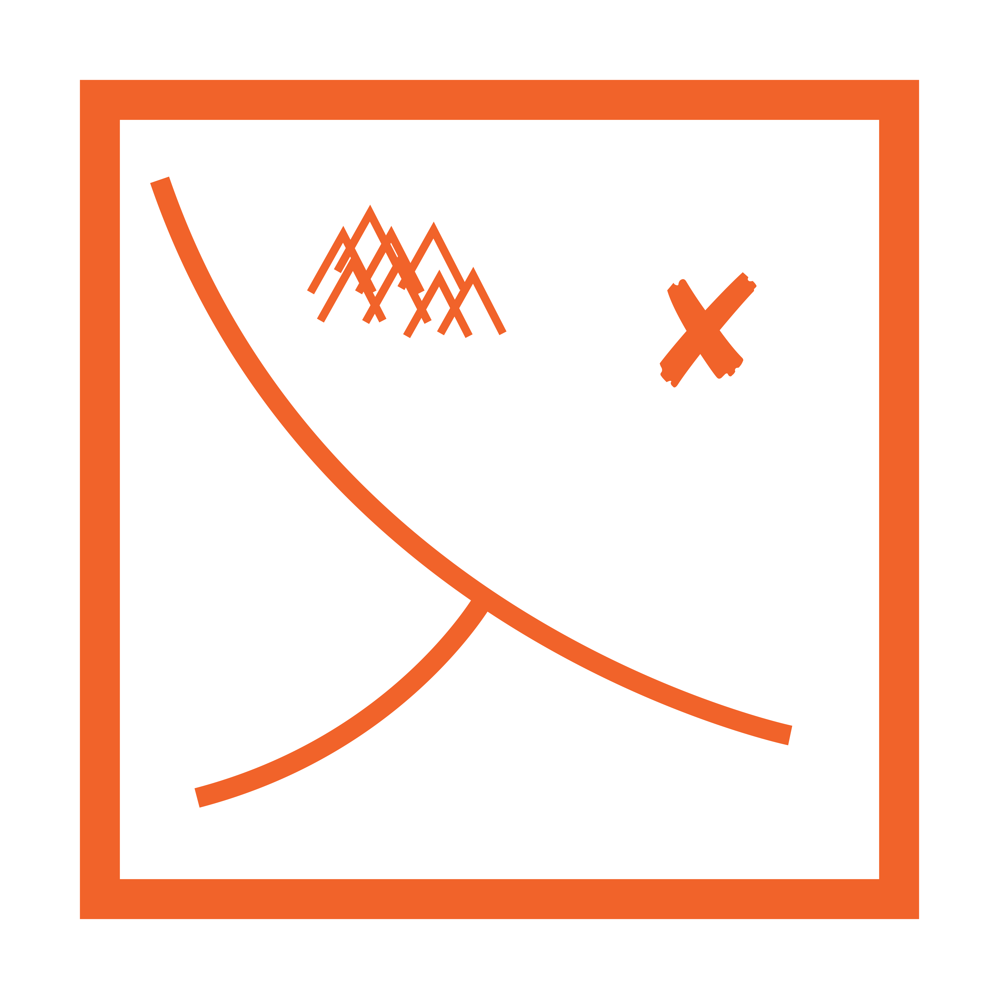

<b><u>Email:</u></b> 
M(dot)S(dot)Pera(at)TUDelft(dot)nl 

<b><u>Address:</u></b>
 
Electric Engineering, Mathematics & Computer Science (EEMCS)  
Van Mourik Broekmanweg 6, 2628 XE Delft 
Office: 3rd Floor, W800  

<b><u>Social Media:</u></b>

		

