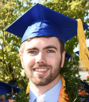

## Current Students

{::comment}
The student list is below.  The styles controlling its formatting are in `_sass/students.scss`. It
automatically takes care of laying out the alternating picture display.
{:/comment}

{: .student-list}

-   
    {: .pic}

    My name is **Devan Karsann** and I’m a first year master’s student in Computer Science. Dr. Sole Pera is my advisor and next semester I’m looking forward to starting my graduate project. I have a data set available to use and soon it will soon be time to defend the project proposal! During the school year I work 30 hours a week at AppDetex, a software startup in downtown Boise. This gives me to take 6 credits a semester and I’m happy about the balance. Right now I’m taking Introduction to Information Retrieval and Large-Scale Data Analysis and they’re both cool classes. My personal website can be found at <http://www.devankarsann.com>.

-   
    {: .pic}

    **Lawrence Spear** is a PhD student in Computer Science, working with Dr. Maria Soledad Pera. Before joining the PIReT Team, he had worked in industry for 20 years. Throughout his career, he has done R&D in the latest techniques in the industry whether it is more process oriented, such as Agile, Behavior Driven Development and Continuous Deployment; or more technical oriented, such as Machine Learning, Infrastructure as Code or .Net Core. His general research interest is information retrieval, such as how children discover new information and how different search engines have to handle non-Latin-based languages. He also has an intense passion for learning new knowledge and broadening his horizons.

## Alumni
**Garrett Allen (M.S.)** *Training Wheels for Web Search: Multi-Perspective Learning to Rank to Support Children's Information Seeking in the Classroom* 

**Ashlee Milton (M.S.)**  *Into the Unknown: Exploration of Search Engines' Responses to Users with Depression and Anxiety* 

**Michael Green (M.S.)**  *Why Don't You Act Your Age?: Recognizing the Stereotypical 8-12 Year Old Searcher by Their Search Behavior* 

**Ion Madrazo Azpiazu (Ph.D.)**  *Multilingual Information Retrieval: A representation building perspective* 

**Axel Magnuson (M.Sc.)**   *Evaluation of Topic Models for Content-Based Popularity Prediction on Social Microblogs* 

**Deepa Mallela (M.Sc.)**   *CEST: City Event Summarization using Twitter* 

**Nevena Dragovic (M.Sc.)**   *When the System Becomes Your Personal Docent: Curating Recommendations to Satisfy User's Needs and Expectations* 

**Ion Madrazo Azpiazu (M.Sc.)**   *Towards Multipurpose Readability Assessment*  

**Oghenemaro Anuyah (M.Sc.)**   *Fostering the Retrieval of Suitable Resources in Response to Children Educational Search Tasks* 

**Jennifer Ekstrand (M.Sc.)**

**David McNeill (B.Sc.)**

**William Bigirimana (B.Sc.)**

**Daniel Bakyono (B.Sc.)**
