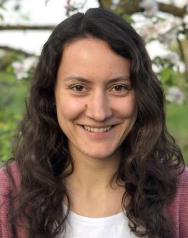
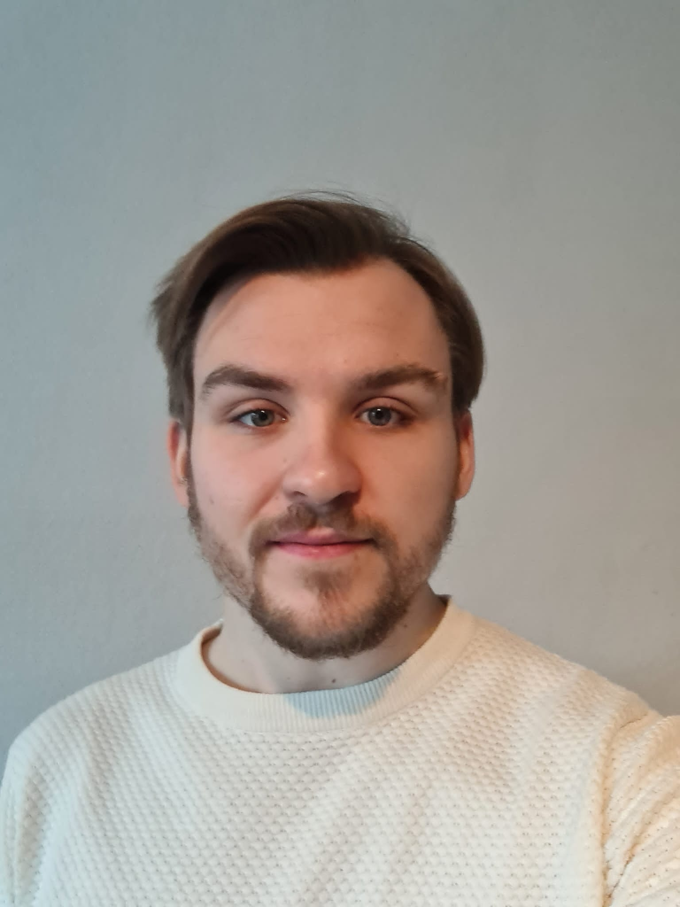

## Current Students

{::comment}
The student list is below.  The styles controlling its formatting are in `_sass/students.scss`. It
automatically takes care of laying out the alternating picture display.
{:/comment}

{: .student-list}

-   
    {: .pic}

    **Alisa Rieger** is a PhD candidate in the Web Information Systems group and an Early Stage Researcher in the NL4XAI project, supervised by Dr. Maria Soledad Pera. Currently, her <a href="https://www.wis.ewi.tudelft.nl/rieger" target="_blank">research </a> is focused on understanding web search on debated topics and mitigating cognitive biases that impede responsible opinion formation, for example, by boosting searchers’ intellectual humility. Before coming to TU Delft, Alisa obtained her BSc and MSc degrees in cognitive science and human-machine interaction from Chemnitz University of Technology.  

-   
    {: .pic}

    **Robin Ungruh** is PhD candidate in the Web Information Systems group at TU Delft, supervised by Dr. Maria Soledad Pera. He obtained a BSc in Human-Computer-Interaction from the University of Hamburg and an MSc in Human-Computer-Interaction from Utrecht University. 
His research is centered on unraveling the complexities of children's interactions with recommender systems, aiming to understand their experiences and developing methods to ensure safe interactions within this vulnerable user group.  
## Alumni
**Devan Karsann (M.Sc.)** *Framework for Facilitating Human Expert Review of Websites for Intellectual Property Infringements* (MS Project) 

**Garrett Allen (M.Sc.)** *Training Wheels for Web Search: Multi-Perspective Learning to Rank to Support Children's Information Seeking in the Classroom* 

**Ashlee Milton (M.Sc.)**  *Into the Unknown: Exploration of Search Engines' Responses to Users with Depression and Anxiety* 

**Michael Green (M.Sc.)**  *Why Don't You Act Your Age?: Recognizing the Stereotypical 8-12 Year Old Searcher by Their Search Behavior* 

**Ion Madrazo Azpiazu (Ph.D.)**  *Multilingual Information Retrieval: A representation building perspective* 

**Axel Magnuson (M.Sc.)**   *Evaluation of Topic Models for Content-Based Popularity Prediction on Social Microblogs* 

**Deepa Mallela (M.Sc.)**   *CEST: City Event Summarization using Twitter* 

**Nevena Dragovic (M.Sc.)**   *When the System Becomes Your Personal Docent: Curating Recommendations to Satisfy User's Needs and Expectations* 

**Ion Madrazo Azpiazu (M.Sc.)**   *Towards Multipurpose Readability Assessment*  

**Oghenemaro Anuyah (M.Sc.)**   *Fostering the Retrieval of Suitable Resources in Response to Children Educational Search Tasks* 

**Jennifer Ekstrand (M.Sc.)**

**Lawrence Spear (PhD)**

**David McNeill (B.Sc.)**

**William Bigirimana (B.Sc.)**

**Daniel Bakyono (B.Sc.)**

**Sharon Guo (B.Sc.)**

**Samantha Anguiano (B.Sc.)**

**Abel Almeida (B.Sc.)**

** Students from the CAST project:  

